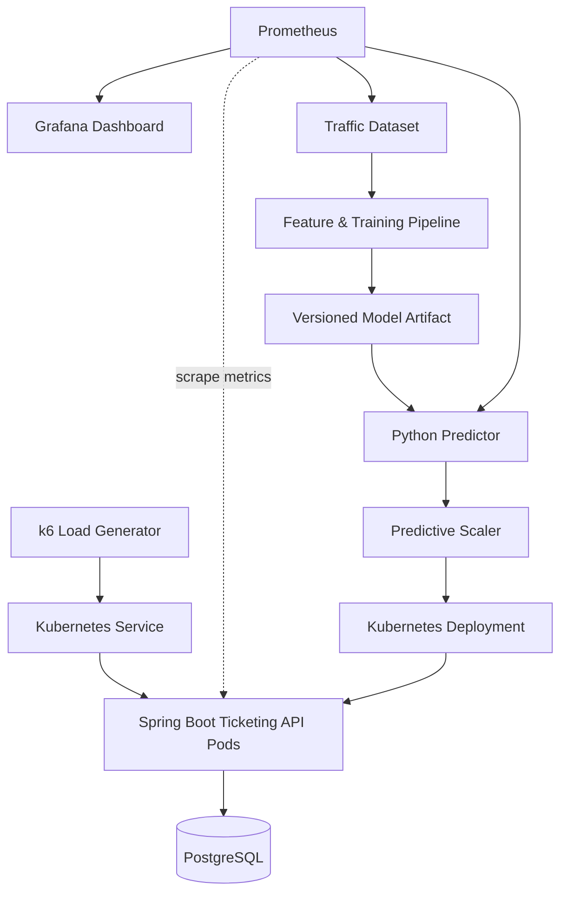

<div align="center">

# ⚡ FlashScale

### Predict the surge. Scale before it hits.

트래픽이 폭증한 **뒤** 대응하는 오토스케일링을 넘어,<br>
미래 요청량을 예측해 Kubernetes 워크로드를 **미리** 확장하는 MLOps 실험 프로젝트


</div>

---

## Why FlashScale?

축제 티켓팅처럼 짧은 시간에 요청이 몰리는 서비스에서는 몇 초의 대응 지연도 긴 대기와 요청 실패로 이어질 수 있습니다. CPU 기반 HPA는 이미 부하가 높아진 뒤에야 replica를 늘리므로, Pod가 준비되는 동안 발생하는 지연을 완전히 피하기 어렵습니다.

FlashScale은 과거 트래픽과 현재 시스템 지표로 가까운 미래의 요청량을 예측하고, 부하가 임계점에 도달하기 전에 Pod를 확장하면 사용자 경험과 리소스 효율이 실제로 개선되는지 검증합니다.

> **Research Question**<br>
> 동일한 급증 트래픽에서 예측 기반 스케일링은 CPU 기반 HPA보다 더 일찍 확장하여, 비슷한 리소스 비용으로 p95/p99 latency와 요청 실패를 줄일 수 있는가?

## Experiment

동일한 부하 시나리오를 세 가지 전략으로 반복 실행해 결과를 비교합니다.

| Strategy | Scaling signal | Expected behavior | Role |
| --- | --- | --- | --- |
| **Fixed Replica** | 없음 | 리소스는 일정하지만 급증 대응이 제한됨 | Control group |
| **CPU-based HPA** | 현재 CPU 사용률 | 임계치를 넘은 뒤 반응형으로 확장 | Reactive baseline |
| **Predictive Scaling** | 미래 요청량 예측 | 급증 전에 선제적으로 확장 | Proposed approach |

### What we measure

| 관점 | 핵심 측정값 |
| --- | --- |
| 사용자 경험 | 요청 성공률, p95/p99 latency |
| 처리 성능 | throughput, 오류율 |
| 기능 정확성 | 품절 좌석의 중복 예약 발생 여부 |
| 확장 동작 | replica 변화, 스케일 아웃 시작 시점, 준비 완료 시점 |
| 리소스 효율 | CPU·메모리 사용량, replica-seconds |
| 모델 품질 | 예측값과 실제 요청량의 오차 |

## Architecture



### From prediction to an infrastructure decision

1. k6가 재현 가능한 급증 트래픽을 생성합니다.
2. Spring Boot API와 Kubernetes의 요청량·지연시간·리소스 지표를 수집합니다.
3. 수집된 시계열 데이터로 baseline 및 Gradient Boosting 모델을 학습합니다.
4. Predictor가 가까운 미래의 요청량을 추론합니다.
5. Scaling policy가 예측값을 필요한 replica 수로 변환합니다.
6. 같은 부하를 고정 replica, HPA, 예측 기반 방식으로 실행하고 결과를 비교합니다.

이 프로젝트의 목표는 단순히 예측 오차를 낮추는 데 있지 않습니다. **데이터 수집 → 학습 → 모델 산출물 → 추론 → 인프라 제어 → 통합 모니터링**을 재현 가능한 흐름으로 연결하고, 모델의 품질이 실제 서비스 지표에 미친 영향을 함께 평가합니다.

## Why MLOps?

| FlashScale workflow | MLOps concern |
| --- | --- |
| 부하·시스템 지표 수집 | Training data pipeline |
| 시간대·최근 요청량 등의 feature 생성 | Feature pipeline |
| 모델 학습 및 평가 | Reproducible experimentation |
| 모델 산출물 저장 및 식별 | Model versioning |
| 실행 중인 시스템에서 미래 트래픽 추론 | Model serving |
| 예측값을 replica 결정에 사용 | Model–infrastructure integration |
| 예측 오차와 서비스 지표를 함께 관찰 | Model & system monitoring |

FlashScale은 ML 모델을 만드는 데서 끝나는 프로젝트가 아니라, **모델을 운영 의사결정 루프 안에 배치하는 프로젝트**입니다. Spring Boot 백엔드, Kubernetes 플랫폼, 성능 실험과 MLOps가 하나의 시스템으로 연결됩니다.

## Tech Stack

| Layer | Technology | Purpose |
| --- | --- | --- |
| Backend | Java, Spring Boot, Spring Data JPA | 티켓팅 API와 동시 예약 제어 |
| Database | PostgreSQL | 좌석·예약 데이터 저장 |
| ML | Python, Gradient Boosting | 미래 요청량 예측 |
| Load Test | k6 | 반복 가능한 트래픽 시나리오 생성 |
| Platform | Docker, kind, Kubernetes, HPA | 로컬 컨테이너 오케스트레이션과 확장 실험 |
| Observability | Prometheus, Grafana | 애플리케이션·인프라 지표 수집 및 시각화 |
| Delivery | GitHub Actions, GHCR | 테스트·이미지 빌드·배포 산출물 자동화 |
| Agent Harness | AGENTS.md, Task, ADR, Verification Script | 에이전트 작업 범위와 검증 절차 통제 |

## Repository Layout

```text
FlashScale/
├── ticketing-api/       # Spring Boot ticketing service
├── predictor/           # training and inference pipeline
├── infra/               # Docker, kind and Kubernetes manifests
├── load-tests/          # k6 scenarios and test data
├── monitoring/          # Prometheus and Grafana configuration
├── scripts/             # reproducible local workflows and verification
├── docs/
│   ├── adr/             # architecture decision records
│   ├── retrospectives/  # daily retrospectives
│   ├── tasks/           # scoped tasks and acceptance criteria
│   └── project-charter.md
└── AGENTS.md             # Codex collaboration and change policy
```

## Local Development

Day 2 기준으로 `ticketing-api`와 `predictor`는 서로 통신하지 않으며 각각 독립적으로 실행할 수 있습니다.

### Prerequisites

- Java 17
- Python 3.10 이상

### Spring Boot Ticketing API

저장소 루트에서 `ticketing-api`로 이동한 뒤 Gradle wrapper로 애플리케이션을 실행합니다.

```bash
cd ticketing-api
./gradlew bootRun
```

기본 포트는 `8080`입니다. 다른 터미널에서 Actuator health endpoint를 확인합니다.

```bash
curl --fail http://localhost:8080/actuator/health
```

테스트는 다음 명령으로 실행합니다.

```bash
cd ticketing-api
./gradlew test
```

포맷 검사와 정적 분석을 포함한 Spring 검증은 다음 명령으로 실행합니다.

```bash
cd ticketing-api
./gradlew spotlessCheck checkstyleMain checkstyleTest test
```

### FastAPI Predictor

저장소 루트에서 `predictor`로 이동해 가상환경을 만들고 런타임·테스트 의존성을 설치합니다.

```bash
cd predictor
python3 -m venv .venv
.venv/bin/python -m pip install -r requirements-test.txt
```

Uvicorn으로 Predictor를 실행합니다.

```bash
.venv/bin/python -m uvicorn app.main:app --reload
```

`app.main:app`은 `app/main.py` 모듈에 선언된 `app = FastAPI(...)` 객체를 실행한다는 뜻입니다. `--reload`는 개발 중 Python 파일이 변경되면 서버를 자동으로 다시 시작합니다.

기본 포트는 `8000`입니다. 다른 터미널에서 health endpoint를 확인합니다.

```bash
curl --fail http://localhost:8000/health
```

테스트는 다음 명령으로 실행합니다.

```bash
cd predictor
.venv/bin/python -m pytest
```

두 애플리케이션은 `Ctrl+C`로 종료할 수 있습니다.

### 전체 검증

Python 가상환경에 `requirements-test.txt`를 설치한 뒤, 저장소 루트의 스크립트 하나로 Spring과 Python의 포맷, 정적 분석/lint, 테스트를 모두 실행할 수 있습니다.

```bash
./scripts/verify.sh
```

스크립트는 자신의 파일 위치로 저장소 루트를 계산하므로 저장소 밖을 포함한 어느 작업 디렉터리에서도 절대 경로로 실행할 수 있습니다. `set -eu`를 사용하므로 검사 하나가 실패하거나 필요한 변수가 준비되지 않으면 즉시 0이 아닌 종료 코드로 끝납니다.

Spring 포맷에는 Java 포맷을 자동화하는 Spotless와 Google Java Format을 사용하고, 정적 분석에는 Gradle의 표준 Java 품질 플러그인인 Checkstyle을 사용합니다. 포맷 대안으로 IDE별 설정만 공유하는 방식은 명령형 검증이 어렵고, 정적 분석 대안인 SpotBugs는 바이트코드 결함 분석에 더 적합해 현재 최소 부트스트랩에는 무겁다고 판단했습니다.

Python은 Ruff 하나로 포맷 검사와 lint를 수행합니다. Black과 Flake8을 각각 두는 대안보다 설치할 도구와 설정 지점이 적으면서 두 검사를 별도 명령과 종료 코드로 유지할 수 있기 때문입니다.

## 30-Day Roadmap

| Phase | Goal | Deliverable |
| --- | --- | --- |
| **01 · Foundation** | 범위·규칙·검증 기반 확립 | Project Charter, AGENTS.md, Task/ADR/회고 템플릿 |
| **02 · Service** | 최소 티켓팅 API와 동시성 안전성 구현 | Spring Boot API, PostgreSQL, concurrency tests |
| **03 · Baselines** | 부하·관측 환경과 비교 기준 구축 | k6, Prometheus/Grafana, fixed replica, HPA |
| **04 · Prediction** | 데이터 파이프라인과 예측기 연결 | baseline, Gradient Boosting, inference component |
| **05 · Evaluation** | 세 전략을 같은 조건에서 반복 비교 | 그래프, 결과표, 한계 분석, 재현 절차 |

### Current status

- [x] 프로젝트 문제와 핵심 가설 정의
- [x] v1 포함·제외 범위 확정
- [x] 저장소 구조 및 에이전트 하네스 준비
- [ ] Spring Boot 티켓팅 API
- [ ] 동시 예약 방지 및 검증
- [ ] k6 부하 시나리오
- [ ] Prometheus/Grafana 관측 환경
- [ ] 고정 replica 및 CPU 기반 HPA baseline
- [ ] 데이터·학습·추론 파이프라인
- [ ] 예측 기반 scaling controller
- [ ] 최종 비교 실험 및 결과 보고서

## Experimental Discipline

전략 간 비교가 공정하고 재현 가능하도록 다음 원칙을 지킵니다.

- 같은 트래픽 프로파일, seed, 실험 시간과 초기 데이터 상태를 사용합니다.
- warm-up 구간과 측정 구간을 분리합니다.
- 각 전략을 여러 번 실행하고 단일 최고 결과가 아닌 분포를 비교합니다.
- 모델 정확도와 시스템 성능을 분리하지 않고 함께 기록합니다.
- 실패한 실험과 채택하지 않은 설계도 회고 및 ADR에 남깁니다.
- 완료 전 관련 테스트와 공통 검증 스크립트를 실행합니다.

## Scope & Non-goals

### v1 includes

Spring Boot 티켓팅 API, PostgreSQL, 동시 예약 방지, k6, Prometheus/Grafana, 트래픽 데이터 수집, baseline 및 Gradient Boosting 모델, 세 가지 scaling 전략 비교, Docker Compose, GitHub Actions, GHCR, kind를 포함합니다.

### v1 intentionally excludes

로그인, 결제, 프론트엔드, 실제 좌석 선택 UI, Redis·분산 대기열, Kafka, Airflow, Kubeflow, KServe, Feast, 딥러닝 시계열 모델, 자동 재학습, 상시 클라우드 배포는 구현하지 않습니다.

명시적인 제외 범위는 기능 부족이 아니라, 30일 안에 핵심 가설을 검증하기 위한 실험 경계입니다.

## Limitations

- kind의 Pod 확장은 실제 클라우드 노드 증설과 동일하지 않습니다. 노드 프로비저닝 시간, 네트워크 변동성, 클라우드 비용은 직접 재현하지 않습니다.
- 합성 부하로 생성한 데이터는 실제 축제 티켓팅 사용자의 행동을 완전히 대표하지 않습니다.
- v1의 비용 비교는 실제 청구 금액이 아닌 replica-seconds와 CPU·메모리 사용량을 대리 지표로 사용합니다.
- 예측 모델은 실험에서 정의한 트래픽 패턴 밖으로 일반화되지 않을 수 있습니다.

따라서 결과는 “모든 운영 환경에서 예측형 스케일링이 우월하다”는 증명이 아니라, **통제된 로컬 환경에서 선제 확장의 효과와 트레이드오프를 정량화한 실험**으로 해석합니다.

## Documentation

- [Development Log](https://velog.io/@eschoi04/series/spring-harness) — FlashScale의 설계·구현 과정과 일일 회고
- [Project Charter](docs/project-charter.md) — 문제, 핵심 실험, 범위와 완료 기준
- [Agent Guidelines](AGENTS.md) — Codex 작업 규칙, 검증 및 변경 정책
- [Tasks](docs/tasks/) — 작업 범위, acceptance criteria와 완료 결과
- [Architecture Decisions](docs/adr/) — 선택지, 결정 이유와 재검토 조건
- [Retrospectives](docs/retrospectives/) — 학습, 시행착오, 검증 결과와 다음 작업

---

<div align="center">

**FlashScale — an MLOps experiment where model predictions become scaling decisions.**

</div>
